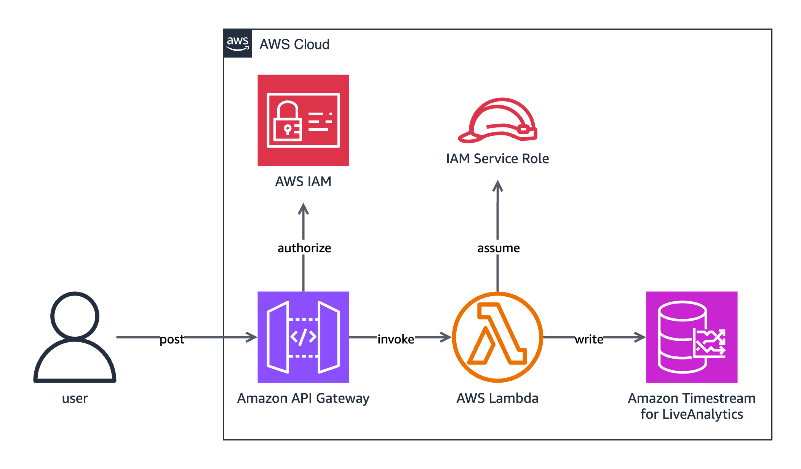

# InfluxDB Timestream Connector

## Overview

The InfluxDB Timestream connector allows [line protocol](https://docs.influxdata.com/influxdb/v2/reference/syntax/line-protocol/) to be ingested to [Amazon Timestream for LiveAnalytics](https://aws.amazon.com/timestream/). The connector parses ingested line protocol and maps the data to multi-measure records for ingestion into Timestream for LiveAnalytics using the [Timestream Write API](https://docs.aws.amazon.com/timestream/latest/developerguide/API_Operations_Amazon_Timestream_Write.html).

### Architecture

The following diagram shows a high-level overview of the connector's architecture when deployed as an [AWS Lambda](https://aws.amazon.com/lambda/) function.



## Table Schema

### Multi-Table Multi-Measure

The following table shows how the connector maps line protocol elements to Timestream for LiveAnalytics record elements.

| Line Protocol Element | Timestream Record Attribute |
|-----------------------|---------------------------|
| Timestamp             | Time                      |
| Tags                  | Dimensions                |
| Fields                | Measures                  |
| Measurements          | Table names               |

A Timestream record's `measure_name` field is not derived from any element of ingested line protocol. Due to the multi-measure record translation, the connector sets the `measure_name` for each multi-measure record to the value of a Lambda environment variable.

The following example shows the translation of a single line protocol point into a Timestream for LiveAnalytics table, using a Timestamp with second precision and a Lambda environment variable configured to `influxdb-measure`:

#### Line Protocol Point

```
cpu_load_short,host=server01,region=us-west value=0.64,average=1.24, 1725059274
```

#### Resulting cpu_load_short Timestream for LiveAnalytics Table

| host     | region  | measure_name     | time                          | value | average |
|----------|---------|------------------|-------------------------------|-------|---------|
| server01 | us-west | influxdb-measure | 2024-08-30 23:07:54.000000000 | 0.64  | 1.24    |

## Deployment Options

### AWS CloudFormation Deployment

The InfluxDB Timestream connector can be deployed within an AWS CloudFormation stack as an AWS Lambda function with an accompanying Amazon REST API Gateway. The API Gateway mimics the InfluxDB v2 API and provides the `/api/v2/write` endpoint for ingestion.

#### Deploying a CloudFormation Stack Using SAM CLI

The stack can be deployed using the [AWS SAM CLI](https://docs.aws.amazon.com/serverless-application-model/latest/developerguide/install-sam-cli.html) and `template.yml`.

1. Run the following command replacing `<region>` with the AWS region you want to deploy in and provide parameter overrides as desired:

    ```shell
    sam --region <region> --parameter-overrides ParameterKey=exampleKey,ParameterValue=exampleValue deploy template.yml
    ```
2. Once the stack has finished deploying, take note of the output "Endpoint" value. This value will be used as the endpoint for all write requests, for example, `<endpoint>/api/v2/write`.

#### Stack Logs

##### Viewing REST API Gateway Logs

By default, execution and access logging is enabled for the REST API Gateway.

To view logs:

1. Visit the [AWS CloudFormation console](https://console.aws.amazon.com/cloudformation/home).
2. In the navigation pane, choose **Stacks**.
3. Choose your deployed stack from the list of stacks.
4. In the **Resources** tab choose the **Physical ID** of the REST API Gateway.
5. In the navigation pane, under **Monitor**, choose **Logging**.
6. From the dropdown menu, select the currently deployed stage.
7. Choose **View logs in CloudWatch**.

##### Viewing Lambda Logs

By default, logging is enabled for the deployed connector.

To view logs:

1. Visit the [AWS CloudFormation console](https://console.aws.amazon.com/cloudformation/home).
2. In the navigation pane, choose **Stacks**.
3. Choose your deployed stack from the list of stacks.
4. In the **Resources** tab choose the **Physical ID** of the Lambda function.
5. In the **Monitor** tab, choose **View CloudWatch logs**.

### Local Deployment

The connector can be run locally using [Cargo Lambda](https://www.cargo-lambda.info/guide/what-is-cargo-lambda.html).

1. [Download and install Rust](https://www.rust-lang.org/tools/install).
2. [Download and install Cargo Lambda](https://www.cargo-lambda.info/guide/installation.html).
3. Configure the following environment variables:
    - `region` string: the AWS region to use. Defaults to `us-east-1`.
    - `database_name` string: the Timestream for LiveAnalytics database name to use. Defaults to `influxdb-line-protocol`.
    - `measure_name_for_multi_measure_records` string: the value to use in records as the measure name. Defaults to `influxdb-measure`.
4. To run the connector on `http://localhost:9000` execute the following command:

    ```shell
    cargo lambda watch
    ```
5. Send all requests to `http://localhost:9000/api/v2/write`.

## Security

### Encryption

When the connector is deployed as part of a CloudFormation stack, the stack's API Gateway ensures all communication is protected by TLS 1.2+.

### Authentication

The REST API Gateway ensures all requests are authenticated with SigV4. Any InfluxDB user tokens or credentials are discarded. This authentication method cannot be correlated to IAM authorization.

## IAM Permissions

### IAM Deployment Permissions

[//]: # (TODO: Update deployment policy with least privilege once REST API Gateway deployment has been tested.)

The following is the least privileged IAM permissions for deploying the connector.

```json
{
    "Version": "2012-10-17",
    "Statement": [
        {
            "Effect": "Allow",
            "Action": [
                "iam:CreateRole",
                "iam:AttachRolePolicy",
                "iam:UpdateAssumeRolePolicy",
                "iam:PassRole",
                "iam:PutRolePolicy"
            ],
            "Resource": [
                "arn:aws:iam::{account-id}:role/AWSLambdaBasicExecutionRole",
                "arn:aws:iam::{account-id}:role/cargo-lambda-role*"
            ]
        },
        {
            "Effect": "Allow",
            "Action": [
                "lambda:CreateFunction",
                "lambda:UpdateFunctionCode",
                "lambda:GetFunction",
                "lambda:UpdateFunctionConfiguration",
                "lambda:GetFunctionConfiguration",
                "lambda:CreateFunctionUrlConfig"
            ],
            "Resource": "arn:aws:lambda:{region}:{account-id}:function:influxdb-timestream-connector"
        }
    ]
}
```

### IAM Execution Permissions

The following is the least privileged IAM permissions for executing the connector.

```json
{
    "Version": "2012-10-17",
    "Statement": [
        {
            "Effect": "Allow",
            "Action": [
                "timestream:WriteRecords",
                "timestream:Select",
                "timestream:DescribeTable",
				"timestream:CreateTable"
            ],
            "Resource": "arn:aws:timestream:{region}:{account-id}:database/influxdb-line-protocol/table/*"
        },
        {
            "Effect": "Allow",
            "Action": [
                "timestream:DescribeEndpoints"
            ],
            "Resource": "*"
        },
        {
            "Effect": "Allow",
            "Action": [
                "timestream:DescribeDatabase",
				"timestream:CreateDatabase"
            ],
            "Resource": "arn:aws:timestream:{region}:{account-id}:database/influxdb-line-protocol"
        }
    ]
}
```

## Example Application with Go Client

A demo Go client application is available under `sample-code/aws-timestream/sample-influxdb-clients/go/line-protocol-client-demo.go` that sends line protocol data to a local or deployed instance of the connector. A line protocol sample dataset is included in `sample-code/aws-timestream/sample-influxdb-clients/data/bird-migration.line`, which the demo application uses for ingestion.

To configure the sample application and ingest all line protocol data contained in `bird-migration.line` to Timestream for LiveAnalytics, perform the following steps:

1. [Download and install Go](https://go.dev/doc/install).
2. [Configure your AWS credentials for use by the AWS SDK for Rust](https://docs.aws.amazon.com/sdkref/latest/guide/creds-config-files.html).
3. [Deploy the Timestream Line Protocol connector locally](#local-deployment).
4. Navigate to `sample-code/aws-timestream/sample-influxdb-clients/go/`.
5. Run the sample Go client:
    - With the connector deployed in a CloudFormation stack, replacing `<region>` with the AWS region you deployed your stack in and `<endpoint>` with the endpoint of your deployed REST API Gateway:
        ```shell
        go run line-protocol-client-demo.go --region <region> --service execute-api --endpoint <endpoint>
        ```
    - With the connector deployed locally:
        ```shell
        go run line-protocol-client-demo.go
        ```
6. Run the following [AWS CLI](https://aws.amazon.com/cli/) command to verify data has been ingested to Timestream for LiveAnalytics, replacing `<region>` with the region you used for ingesting data:
    ```shell
    aws timestream-query query \
        --region <region> \
        --query-string 'SELECT * FROM "influxdb-line-protocol"."migration1" LIMIT 10'
    ```

## Troubleshooting

### Amazon Timestream Write API Errors

| Error | Status Code | Description | Solution |
|-------|-------------|-------------|----------|
| `AccessDeniedException` | 400 | You are not authorized to perform this action. | Verify that your user has the [correct permissions](#iam-permissions). |
| `InternalServerException` | 500 | Timestream was unable to fully process this request because of an internal server error. | Try ingesting records at another time. |
| `RejectedRecordsException` | 400 | The records sent to Timestream were invalid. | Check the [line protocol limitations](#line-protocol-limitations) and [caveats](#caveats) and ensure your line protocol points abide by expected formatting.
| `ResourceNotFoundException` | 400 | The operation tried to access a nonexistent resource. The resource might not be specified correctly, or its status might not be ACTIVE. | Verify that your database exists in Timestream for LiveAnalytics. Consider setting `enable_database_creation` to `true` to allow the connector to create the database for you. |
| `ServiceQuotaExceededException` | 400 | The instance quota of resource exceeded for this account. | Confirm you are not exceeding Timestream for LiveAnalytics' quotas. If you are not exceeding any quotas, check the list of [line protocol limitations](#line-protocol-limitations) below, specifically the number of unique measurement names. |
| `ThrottlingException` | 400 | Too many requests were made by a user and they exceeded the service quotas. The request was throttled. | Decrease the rate of your requests. |


## Limitations

### Line Protocol Limitations

Due to the connector translating line protocol to Timestream records, line protocol must satisfy [Timestream for LiveAnalytics' quotas](https://docs.aws.amazon.com/timestream/latest/developerguide/ts-limits.html).

| Line Protocol Component | Limitation |
|-------------------------|------------|
| Maximum size of a line protocol point, with `measure_name` included. | 2 Kilobytes |
| Number of unique tag keys per table. | 128 |
| Maximum tag key size. | 60 bytes |
| Maximum measurement name size. | 256 bytes |
| Maximum unique measurement names per database (using multi-table multi-measure schema). | 50,000 |
| Maximum field key size. | 256 bytes |
| Maximum number of fields per point. | 256 |
| Maximum field value size. | 2048 bytes |
| Maximum unique field key values. | 1024 |
| Latest valid timestamp. | Fifteen minutes in the future from the current time. |
| Oldest valid timestamp. | `mag_store_retention_period` days before the current time. |

## Caveats

### Line Protocol Tag Requirement

In order to ingest to Timestream for LiveAnalytics, every line protocol point must include at least one tag.
